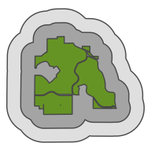
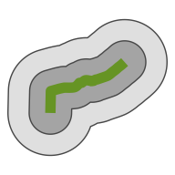

### Buffer distance

-----

Buffer distances (in miles) extend from the perimeter of units. For
trails, the buffer distance is effectively a radius (i.e. a 1.0 mile
buffer on each side of a trail would mean a 2.0 mile diameter path
centered on the trail.)  

Example of buffer distances around a park polygon

<!-- -->

Example of buffer distances around a trail segment

<!-- -->
